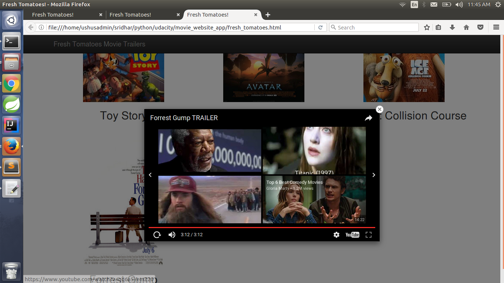

# Movie-Trailer-Website
Movie Trailer Website 
Please clone the repository: 
git clone https://github.com/Sridharc20/Movie-Trailer-Website.git 
cd Movie-Trailer-Website 
#install python 2.7 
$python entertainment_center.py 
Sample Input:
  please enter the movie details: 
  Enter Movie Name: 
  Forrest Gump 
  Enter Movie story line 
  Forrest Gump recounts his life story to strangers who sit next to him on a bench in Savannah, Georgia      
  Enter movie poster image location 
  https://upload.wikimedia.org/wikipedia/en/thumb/6/67/Forrest_Gump_poster.jpg/220px-Forrest_Gump_poster.jpg 
  Enter movie trailer youtube link 
  https://www.youtube.com/watch?v=uPIEn0M8su0 
  Can you please rate the movie ['G', 'PG', 'PG-13', 'R'] 
  G 
Thanks for sharing the movie details, please verify in the browser 

